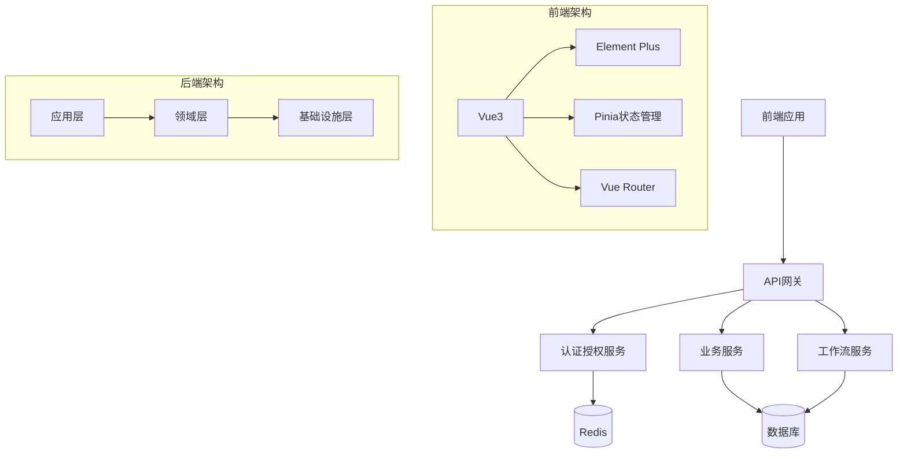

# Lean.Cur

<div align="center">
    
    <h1>Lean.Cur</h1>
    <h3>基于.NET Core的轻量级权限管理系统</h3>
    <p>采用DDD领域驱动设计，完全由Cursor AI自动创建</p>
    <p><b>当前版本: v0.0.1</b></p>
    
[](https://gitee.com/lean365/Lean.Cur)
[](https://gitee.com/lean365/Lean.Cur)
[](https://github.com/lean365/Lean.Cur)
[](https://github.com/lean365/Lean.Cur)
[](https://github.com/lean365/Lean.Cur/blob/master/LICENSE)
[](https://github.com/lean365/Lean.Cur)
[](https://github.com/lean365/Lean.Cur)

[English](./README.en.md) | 简体中文
</div>

## 📚 项目介绍

Lean.Cur 是一个基于.NET Core 8.0 + Vue 3的前后端分离的轻量级权限管理系统，采用DDD领域驱动设计思想，内置代码生成器，支持多语言，可快速构建标准化的信息管理系统。

### 🎯 项目特点

- **领域驱动设计**：采用DDD架构，实现业务逻辑与技术实现的分离
- **统一权限管理**：基于RBAC的权限控制，支持细粒度的权限管理
- **代码生成器**：内置代码生成器，快速生成标准化的CRUD代码
- **多语言支持**：内置国际化支持，轻松切换多种语言
- **安全性**：集成JWT认证、防XSS攻击、SQL注入防护等多重安全机制
- **最佳实践**：遵循Clean Architecture架构原则，代码组织清晰
- **高性能**：采用SqlSugar ORM，支持多种数据库

## 🔥 系统架构



## 🛠️ 技术栈

### 后端技术
- 核心框架：.NET Core 8.0
- ORM框架：SqlSugar
- 缓存框架：Redis
- 日志框架：NLog
- 对象映射：Mapster
- 认证框架：JWT
- 接口文档：Swagger
- 单元测试：xUnit

### 前端技术
- 核心框架：Vue 3
- UI框架：Element Plus
- 状态管理：Pinia
- 路由管理：Vue Router
- HTTP客户端：Axios
- 构建工具：Vite
- 代码规范：ESLint + Prettier
- 国际化：vue-i18n

## 📦 项目结构

```
Lean.Cur/
├── backend/                # 后端项目
│   └── Src/
│       ├── Lean.Cur.Api/           # API层：接口控制器
│       ├── Lean.Cur.Application/   # 应用层：应用服务
│       ├── Lean.Cur.Domain/        # 领域层：领域模型
│       ├── Lean.Cur.Infrastructure/# 基础设施层：技术实现
│       ├── Lean.Cur.Common/        # 公共层：通用功能
│       └── Lean.Cur.Generator/     # 代码生成器
└── frontend/              # 前端项目
    ├── src/              # 源代码
    │   ├── api/         # API接口
    │   ├── components/  # 公共组件
    │   ├── hooks/       # 组合式函数
    │   ├── router/      # 路由配置
    │   ├── store/       # 状态管理
    │   └── views/       # 页面组件
    └── types/           # 类型声明
```

## 🚀 快速开始

### 环境要求

- .NET Core SDK 8.0+
- Node.js 18.0+
- Redis 6.0+
- MySQL 8.0+ / SQL Server 2012+

### 本地开发

1. 获取代码
```bash
git clone https://github.com/lean365/Lean.Cur.git
cd Lean.Cur
```

2. 后端启动
```bash
cd backend/Src/Lean.Cur.Api
dotnet restore
dotnet run
```

3. 前端启动
```bash
cd frontend
pnpm install
pnpm dev
```

### 部署说明

1. 后端部署
```bash
cd backend/Src/Lean.Cur.Api
dotnet publish -c Release
```

2. 前端部署
```bash
cd frontend
pnpm build
```

## 📋 核心功能

### 用户权限管理
- 用户管理：用户信息管理，支持用户状态控制
- 角色管理：角色配置，角色与权限关联
- 权限管理：细粒度的权限控制，支持按钮级别权限

### 系统功能
- 菜单管理：配置系统菜单，支持多级菜单
- 部门管理：机构部门管理，支持树形结构
- 岗位管理：岗位信息维护，支持岗位分配

### 系统监控
- 操作日志：记录用户操作，支持查询和回溯
- 登录日志：记录登录信息，支持登录分析
- 服务监控：监控服务器状态，记录系统性能

## 🔨 代码生成器

### 支持功能
- 自动生成前后端代码
- 支持自定义模板
- 支持批量生成
- 支持表单验证
- 支持多语言

### 使用方法
```bash
cd backend/Src/Lean.Cur.Generator
dotnet run
```

## 📝 开发规范

### 代码规范
- 遵循领域驱动设计原则
- 使用Clean Architecture架构
- 遵循SOLID设计原则
- 编写单元测试

### Git提交规范
- feat: 新功能
- fix: 修复bug
- docs: 文档更新
- style: 代码格式
- refactor: 重构
- test: 测试
- chore: 构建过程或辅助工具的变动

## 🤝 贡献指南

1. Fork 本仓库
2. 创建新的分支: `git checkout -b feature/your-feature`
3. 提交你的更改: `git commit -am 'Add some feature'`
4. 推送到分支: `git push origin feature/your-feature`
5. 提交Pull Request

## 📄 开源协议

本项目使用 [MIT](LICENSE) 协议

## 👥 维护者

- [@lean365](https://github.com/lean365)

## 🙏 致谢

感谢所有为这个项目做出贡献的开发者！

## 📞 联系我们

- 邮箱：lean365@qq.com
- QQ群：686737882
- 微信：lean365_cn

## 🎉 项目展示

<table>
    <tr>
        <td></td>
        <td></td>
    </tr>
    <tr>
        <td></td>
        <td></td>
    </tr>
</table>

## 📈 版本管理

### 版本号规范
- **格式**: v主版本号.次版本号.修订版本号
- **主版本号**: 0-9, 架构升级或重大功能变更
- **次版本号**: 0-99, 新功能添加或功能优化
- **修订版本号**: 0-999, Bug修复或小改动

### 组件版本对应
- 后端API: v0.0.1
- 前端UI: v0.0.1
- 代码生成器: v0.0.1
- 数据库脚本: v0.0.1

### 更新日志

#### v0.0.1 (2024-01-15) - 初始版本
- 🎉 项目初始化
  - 基础框架搭建
  - 项目结构定义
  - 开发规范制定
- ✨ 核心功能
  - 用户管理基础功能
  - 权限管理基础功能
  - 系统监控基础功能
- 📝 文档
  - README编写
  - 开发文档基础版本
  - 数据库设计文档

### 开发计划
#### v0.0.2 (计划中)
- 完善用户权限管理
- 完善系统功能
- 优化代码生成器
- 添加单元测试

#### v0.0.3 (计划中)
- 工作流基础功能
- 多语言支持
- 性能优化
- 安全性增强

#### v0.1.0 (计划中)
- 完整的工作流系统
- 完整的多语言支持
- 完整的系统监控
- 第一个稳定版本发布
