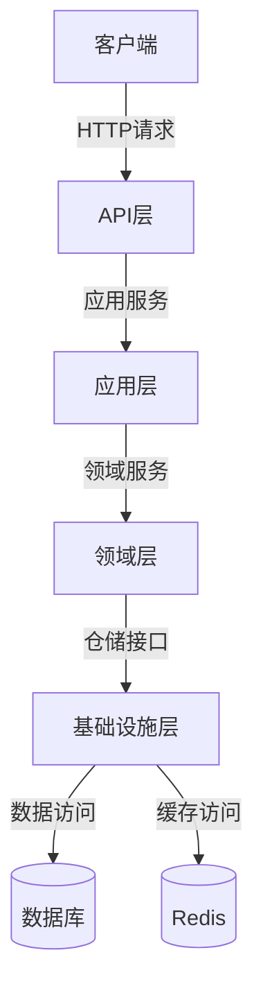
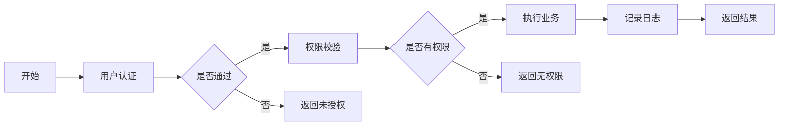
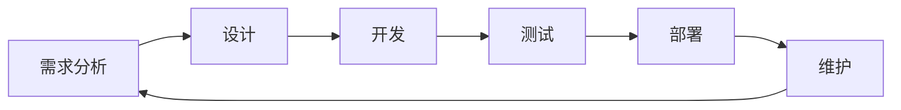
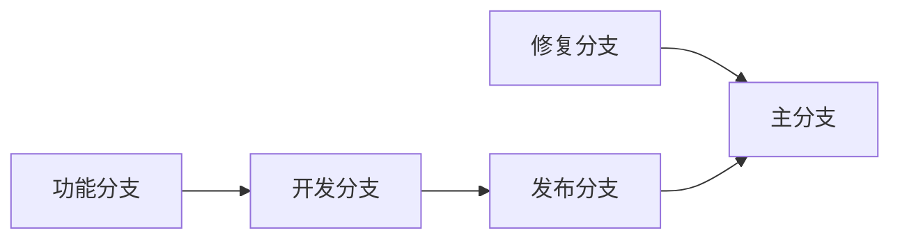
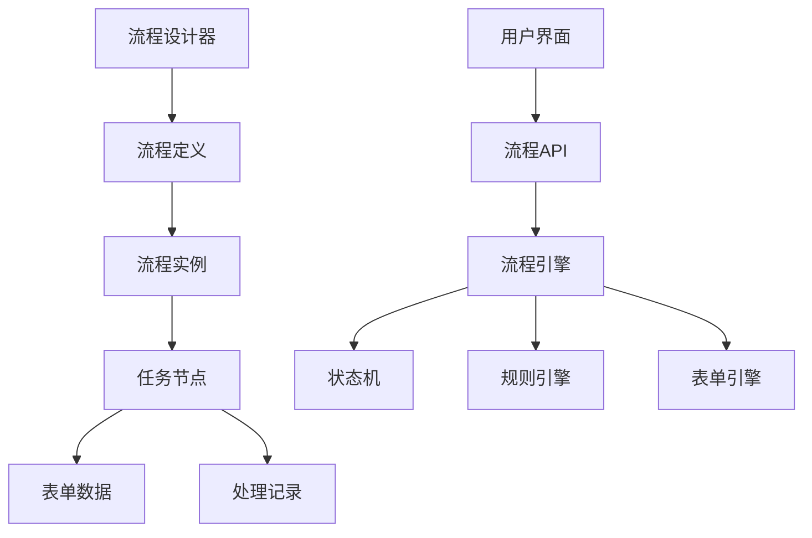
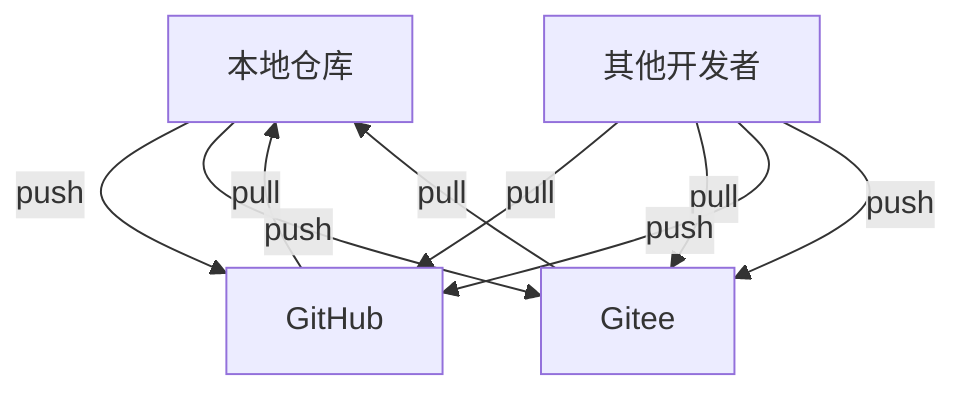

# Lean.Cur

<div align="center">
    
    <h1>Lean.Cur</h1>
    <h3>基于.NET Core的轻量级权限管理系统</h3>
    <p>采用DDD领域驱动设计，完全由Cursor AI自动创建</p>
    
[](https://gitee.com/lean365/Lean.Cur)
[](https://gitee.com/lean365/Lean.Cur)
[](https://github.com/lean365/Lean.Cur)
[](https://github.com/lean365/Lean.Cur)
[](https://github.com/lean365/Lean.Cur/blob/master/LICENSE)
[](https://github.com/lean365/Lean.Cur)
</div>

[English](./README.en.md) | 简体中文

## 项目特点

- 🎯 **领域驱动设计**：采用DDD架构，实现业务逻辑与技术实现的分离
- 🔐 **统一权限管理**：基于RBAC的权限控制，支持细粒度的权限管理
- 🚀 **代码生成器**：内置代码生成器，快速生成标准化的CRUD代码
- 🌐 **多语言支持**：内置国际化支持，轻松切换多种语言
- 🛡️ **安全性**：集成JWT认证、防XSS攻击、SQL注入防护等多重安全机制
- 💡 **最佳实践**：遵循Clean Architecture架构原则，代码组织清晰
- ⚡ **高性能**：采用SqlSugar ORM，支持多种数据库

## 工作流程

### 系统架构图



### 业务流程图



### 开发工作流



### Git工作流



## 核心功能

### 用户权限管理
- 用户管理：用户信息管理，支持用户状态控制
- 角色管理：角色配置，角色与权限关联
- 权限管理：细粒度的权限控制，支持按钮级别权限

### 系统功能
- 菜单管理：配置系统菜单，支持多级菜单
- 部门管理：机构部门管理，支持树形结构
- 岗位管理：岗位信息维护，支持岗位分配

### 系统监控
- 操作日志：记录用户操作，支持查询和回溯
- 登录日志：记录登录信息，支持登录分析
- 服务监控：监控服务器状态，记录系统性能

## 技术架构

### 后端技术
- 核心框架：.NET Core 8.0
- ORM框架：SqlSugar
- 缓存框架：Redis
- 日志框架：NLog
- 对象映射：Mapster
- 认证框架：JWT
- 接口文档：Swagger
- 单元测试：xUnit
- 依赖注入：Microsoft.Extensions.DependencyInjection
- 配置管理：Microsoft.Extensions.Configuration

### 前端技术（规划中）
- 核心框架：Vue 3
- UI框架：Ant Design Vue
- 状态管理：Pinia
- 路由管理：Vue Router
- HTTP客户端：Axios
- 构建工具：Vite
- 代码规范：
  - ESLint + Prettier
  - Ant Design Vue 规范
  - TypeScript 规范
- 国际化：vue-i18n
- 主题定制：Less 变量
- 图标：@ant-design/icons-vue
- 工具库：
  - dayjs（时间处理）
  - lodash（工具函数）
  - vue-types（类型检查）

## 项目结构

```
Lean.Cur/
├── backend/                # 后端项目
│   └── Src/
│       ├── Lean.Cur.Api/           # API层：接口控制器、过滤器、中间件
│       ├── Lean.Cur.Application/   # 应用层：DTO、服务接口和实现
│       ├── Lean.Cur.Domain/        # 领域层：实体、仓储接口、领域服务
│       ├── Lean.Cur.Infrastructure/# 基础设施层：仓储实现、工具类
│       ├── Lean.Cur.Common/        # 公共层：枚举、常量、通用类
│       ├── Lean.Cur.Generator/     # 代码生成器：快速生成代码
│       └── Lean.Cur.Workflow/      # 工作流引擎：流程定义、任务处理
└── frontend/              # 前端项目
    ├── src/              # 源代码
    │   ├── api/         # API接口定义
    │   ├── assets/      # 静态资源
    │   │   ├── icons/   # 图标文件
    │   │   ├── images/  # 图片资源
    │   │   └── styles/  # 样式文件
    │   ├── components/  # 公共组件
    │   │   ├── Basic/   # 基础组件
    │   │   └── Form/    # 表单组件
    │   ├── hooks/       # 组合式函数
    │   ├── layouts/     # 布局组件
    │   ├── locales/     # 国际化资源
    │   ├── router/      # 路由配置
    │   ├── store/       # 状态管理
    │   │   ├── modules/ # 状态模块
    │   │   └── types/   # 类型定义
    │   ├── utils/       # 工具函数
    │   └── views/       # 页面组件
    │       ├── system/  # 系统管理
    │       ├── monitor/ # 系统监控
    │       └── workflow/# 工作流管理
    ├── public/          # 公共资源
    ├── types/           # 类型声明
    ├── vite.config.ts   # Vite配置
    ├── tsconfig.json    # TypeScript配置
    ├── package.json     # 项目依赖
    └── index.html       # 入口HTML
```

### 工作流引擎

Lean.Cur.Workflow 是系统的工作流引擎模块，提供灵活的业务流程定义和处理能力。

#### 核心功能

- **流程设计**
  - 可视化流程设计器
  - 支持串行、并行、条件分支
  - 动态表单配置
  - 节点权限控制

- **流程管理**
  - 流程定义管理
  - 流程实例管理
  - 任务处理
  - 流程监控

- **任务处理**
  - 待办任务
  - 已办任务
  - 我发起的
  - 抄送我的

#### 技术特点

- 基于状态机实现
- 支持流程回退、撤回、转办
- 支持自定义表单
- 支持流程追踪
- 支持多种审批方式
  - 会签（需要所有审批人同意）
  - 或签（一人同意即可）
  - 依次审批
  - 并行审批

#### 使用场景

1. **请假审批**
   - 发起申请
   - 直属领导审批
   - 部门经理审批
   - HR备案

2. **报销流程**
   - 提交报销
   - 项目经理审批
   - 财务审核
   - 出纳付款

3. **采购审批**
   - 提交采购申请
   - 部门预算审核
   - 采购部门确认
   - 分管领导审批

4. **自定义流程**
   - 支持通过可视化设计器自定义业务流程
   - 配置节点处理人
   - 设置审批规则
   - 关联业务表单

#### 架构设计



#### 开发指南

1. **流程定义**
```csharp
public class LeaveProcess : WorkflowDefinition
{
    public override void Define()
    {
        StartNode("提交申请")
            .Then("直属领导审批")
            .Then("部门经理审批")
            .Then("HR备案")
            .End();
    }
}
```

2. **节点配置**
```csharp
public class LeaveNode : WorkflowNode
{
    public override async Task<bool> Execute(WorkflowContext context)
    {
        // 节点处理逻辑
        return await ProcessNode(context);
    }
}
```

3. **表单定义**
```csharp
public class LeaveForm : IWorkflowForm
{
    public string Title { get; set; }
    public DateTime StartTime { get; set; }
    public DateTime EndTime { get; set; }
    public string Reason { get; set; }
}
```

## 快速开始

### 环境要求
- .NET Core SDK 8.0+
- Visual Studio 2022+ / VS Code
- SQL Server 2012+ / MySQL 5.7+
- Redis 6.0+
- Node.js 16+

### 开发环境设置
1. 克隆仓库
```bash
git clone https://github.com/Lean365/Lean.Cur.git
```

2. 还原包
```bash
cd Lean.Cur/backend
dotnet restore
```

3. 修改数据库连接
- 打开 `Lean.Cur.Api/appsettings.json`
- 修改数据库连接字符串
- 配置Redis连接信息

4. 运行项目
```bash
cd Lean.Cur.Api
dotnet run
```

5. 访问接口文档
```
http://localhost:5000/swagger
```

### 部署说明

1. **发布后端**
```bash
dotnet publish -c Release -o ./publish
```

2. **配置IIS**
- 创建网站
- 配置应用程序池(.NET Core)
- 设置绑定信息

3. **环境变量**
- 设置ASPNETCORE_ENVIRONMENT
- 配置数据库连接字符串
- 配置Redis连接信息

4. **前端部署**
```bash
# 安装依赖
cd frontend
npm install

# 开发环境运行
npm run dev

# 构建生产环境
npm run build

# 部署到生产服务器
# 1. 将dist目录下的文件复制到web服务器目录
# 2. 配置nginx
server {
    listen 80;
    server_name your-domain.com;
    
    location / {
        root /path/to/dist;
        try_files $uri $uri/ /index.html;
        index index.html;
    }
    
    # API代理配置
    location /api {
        proxy_pass http://localhost:5000;
        proxy_set_header Host $host;
        proxy_set_header X-Real-IP $remote_addr;
    }
}

# 3. 重启nginx
nginx -s reload
```

5. **环境变量配置**
```bash
# 创建环境配置文件
cp .env.example .env.production

# 修改生产环境配置
VUE_APP_BASE_API=/api
VUE_APP_ENV=production
```

6. **前端更新部署**
```bash
# 拉取最新代码
git pull

# 更新依赖
npm install

# 重新构建
npm run build

# 替换部署文件
cp -r dist/* /path/to/nginx/html/

# 清理缓存
nginx -s reload
```

## 版本发布

本项目使用GitHub Actions自动化工作流进行版本发布。每次发布新版本时：

1. 创建新的版本标签：
```bash
git tag v1.0.0
git push origin v1.0.0
```

2. GitHub Actions将自动：
- 生成更新日志
- 创建新的Release
- 发布版本

## 贡献指南

1. Fork本仓库
2. 创建特性分支 (`git checkout -b feature/AmazingFeature`)
3. 提交更改 (`git commit -m 'feat: 添加新特性'`)
4. 推送到分支 (`git push origin feature/AmazingFeature`)
5. 创建Pull Request

### 提交规范
- feat: 新功能
- fix: 修复问题
- docs: 文档修改
- style: 代码格式修改
- refactor: 重构代码
- perf: 优化相关
- test: 测试相关
- chore: 其他修改

## 常见问题

1. **数据库连接失败**
   - 检查连接字符串格式
   - 确认数据库服务是否启动
   - 验证用户权限

2. **Redis连接异常**
   - 检查Redis服务状态
   - 验证连接配置
   - 确认防火墙设置

3. **JWT认证失败**
   - 检查Token格式
   - 验证密钥配置
   - 确认Token是否过期

4. **性能问题**
   - 检查数据库索引
   - 优化查询语句
   - 配置缓存策略

## 开源协议

本项目采用MIT协议。详见 [LICENSE](LICENSE) 文件。

## 联系我们

- Issues: [github.com/Lean365/Lean.Cur/issues](https://github.com/Lean365/Lean.Cur/issues)
- 讨论: [github.com/Lean365/Lean.Cur/discussions](https://github.com/Lean365/Lean.Cur/discussions)
- 邮箱: support@lean365.com
- QQ群: 123456789

## 致谢

感谢以下开源项目：

- [.NET Core](https://github.com/dotnet/core)
- [SqlSugar](https://github.com/sunkaixuan/SqlSugar)
- [Vue.js](https://github.com/vuejs/core)
- [Ant Design Vue](https://github.com/vueComponent/ant-design-vue)

## Git 同步说明

### 分支说明
- `main`: 主分支，用于生产环境部署
- `develop`: 开发分支，用于开发环境测试
- `feature/*`: 功能分支，用于新功能开发
- `hotfix/*`: 修复分支，用于紧急bug修复
- `release/*`: 发布分支，用于版本发布

### 同步操作
```bash
# 1. 添加远程仓库
git remote add github https://github.com/Lean365/Lean.Cur.git
git remote add gitee https://gitee.com/lean365/Lean.Cur.git

# 2. 拉取远程代码
git fetch --all

# 3. 同步主分支
git checkout main
git pull github main
git pull gitee main

# 4. 推送到远程仓库
git push github main
git push gitee main

# 5. 同步标签
git fetch --tags
git push github --tags
git push gitee --tags
```

### 常见问题处理
```bash
# 1. 解决冲突
git status                    # 查看冲突文件
git add .                     # 解决冲突后标记为已解决
git commit -m "fix: 解决冲突"  # 提交解决结果

# 2. 回退版本
git reset --hard HEAD^        # 回退到上一个版本
git reset --hard <commit_id>  # 回退到指定版本

# 3. 撤销修改
git checkout -- <file>        # 撤销工作区修改
git reset HEAD <file>         # 撤销暂存区修改

# 4. 分支管理
git branch -a                 # 查看所有分支
git checkout -b <branch>      # 创建并切换分支
git merge <branch>            # 合并指定分支
git branch -d <branch>        # 删除分支
```

### 同步工作流

